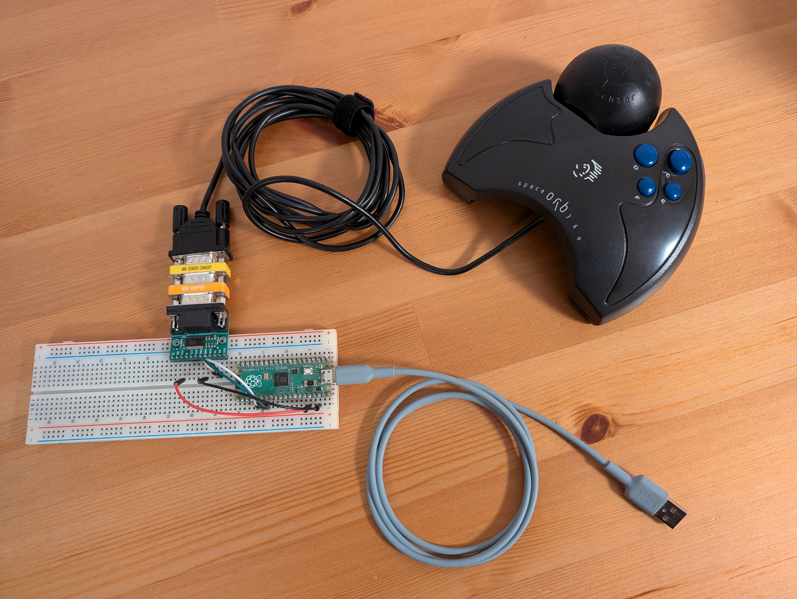

# SpaceOrb 360 with modern software



This project lets you use an old SpaceOrb 360 controller with modern software on modern operating systems.

There are two options:

Option 1 simulates a 3Dconnexion SpaceMouse Pro, so it can be used with software like Fusion, 3ds Max, SolidWorks, Inventor, Maya and many others. No special software is required on the computer, apart from 3DxWare. From the computer's point of view, your old SpaceOrb will look like a real SpaceMouse Pro connected over USB.

Option 2 works as a six-axis generic joystick, letting you use the SpaceOrb in games like Descent (specifically, [DXX-Rebirth](https://github.com/dxx-rebirth/dxx-rebirth)).

You can either use the [RP2040-RS232](https://github.com/jfedor2/rp2040-rs232) adapter or you can make one yourself as described below. If you use the RP2040-RS232 adapter, the multi-firmware that comes with it includes the SpaceOrb firmware. You can also just use the one linked here.

To make one yourself you will need:

- Raspberry Pi Pico
- [Pololu 23201a Serial Adapter](https://www.pololu.com/product/126)
- null modem adapter and DB9 gender changer (either as two separate adapters or one that does both)
- breadboard and some jumper wires

Make the following connections between the Pico and the serial adapter:

| Pico | serial adapter |
| -----: | ------ |
| 3V3 (pin 36) | VCC |
| GND (pin 23) | GND |
| GPIO20 (pin 26) | RX |
| GPIO21 (pin 27) | TX |

Flash the Pico with the firmware file the usual way: hold the BOOTSEL button while connecting the board to the computer, then copy the UF2 file to the USB drive that shows up.

There are two firmware files:

[spaceorb.uf2](spaceorb.uf2) emulates a SpaceMouse Pro. To use it you have to install 3DxWare on your computer. Buttons on the SpaceOrb (`A`, `B`, `C`, `D`, `E`, `F`, the button on the back) are mapped to the following buttons on the emulated SpaceMouse Pro: `1`, `2`, `3`, `4`, `Ctrl`, `Alt`, `Shift`. You can assign functions to them in 3Dconnexion's software. (Please note that the button on the back also zeroes all the axes on the SpaceOrb.)

[spaceorb_joystick.uf2](spaceorb_joystick.uf2) works as a generic six-axis joystick and doesn't require any additional drivers.

Firmware builds for the Pico 2 are also provided.

## How to compile the firmware

```
git clone https://github.com/jfedor2/spaceorb360.git
cd spaceorb360
git submodule update --init
mkdir build
cd build
cmake ..
make
```
